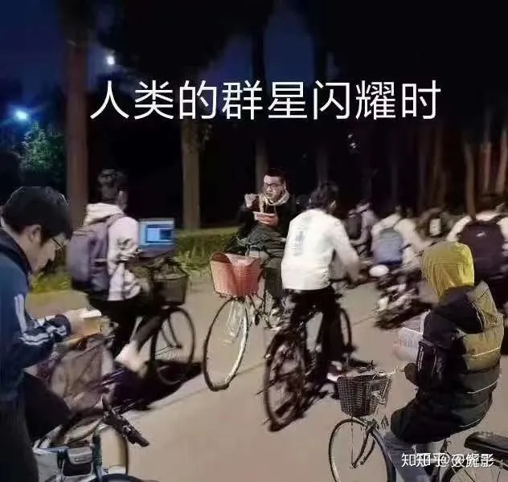

# 清华四字班梗字典

本字典可用作水群/与清华同学交流时的日常用语参考。

> Tips : 推荐使用 *Ctrl+F* 来查找所需内容

## 北大相关

- PKU/P大/我北/隔壁: 指北京大学 Peking University（#94070A ref: [北京大学标识管理办公室](https://vim.pku.edu.cn/cjwt/index.htm)）

- THU/T大/你清/你校: 指清华大学 Tsinghua University（#660874 / Pantone 259C ref:[清华大学视觉形象识别系统](https://vi.tsinghua.edu.cn/gk/xxbz/scgf.htm)）

- 华大/华清大学: 通常用于饱含恶意地影射华大学。

- 华大学：源于之前清华大学东南门外“清华大学”石雕被撞，仅存“华大学”三字和“厚德载物自强”校训。

- 精北: 即比起清华人，在精神上更像是北大人，崇尚北京大学“思想自由，兼容并包”的风气。

## 各种缩写

- ddl: 即deadline，一般指作业截止日期，有时也泛指某个事情到期时间或某项任务。例句“我有两个ddl搞不完了”。

- xm: 即羡慕

- 特奖：清华大学特等奖学金，名额极少。

- 树洞：一个校内论坛，上面会有各种各样的猎奇感情故事和校园传说。~~网址为thuhole.com，需要邮箱注册~~(thuhole.com已于2021年关停。R.I.P) （[新树洞](https://new-t.github.io/)需要魔法（注：这是一个完全匿名平台，接受能力差者谨慎访问）

- 1911平台：清华大学官方建立的一个校内论坛，网址为 planet.tsinghua.edu.cn ，论坛前台可选匿名后台实名。

- xxx小助手：一些第三方恰广告钱的微信账号，请注意防骗。

- GPA: 绩点（grade point average），类似于高中的成绩，最高4.0。

- npy：男/女朋友，多用以指（下略）。~~现在的人其实比起npy，更想要py~~

- 现充/人赢/线虫/🐛：现实生活充实的人，代指有npy的人

- 手癌：指打字出现错别字的情形，修正时可用“\*+修正后的字段”。手癌写诗是好文明（确信）。也简称“癌”

- 卖弱/麦若：假装自己什么都不会、装颓废或者假装自己没考好的行为，是大佬们的常见戏码。

- 膜/mol：膜拜的简称，指对长者表示敬意，或者对群内大佬表示仰慕。

## 清华特色

- 大作业：顾名思义，是一种常见而可怕的东西。一门课程可能会同时布置小作业、大作业，大作业综合性强，要求较高，时常令人害怕

- X字班：从古至今的清华人沟通的校内黑话。入学年份的最后一位记为X，则称生为X字班同学。如各位是四字班，而我们这些即将大二的狗是三字班。可在“校友”见面时，用于简单识别是不是清华学生（诈骗还是很多的 做好防范）

- 乌鸦：你清特产，晚上很吵，见到快跑，会投弹攻击（指鸟粪）。

- 土豆：极其先进的信息化系统所使用的服务器。出典：2000年，一位名为佛瑞德·怀特的男子创造了一台用5个马铃薯为动力的Web服务器，这服务器每秒钟仅可以处理0.2个页面请求，也就是说大概5秒钟才能处理一个完整的用户请求。最终怀特放弃这台服务器，不过他放弃的主要原因不是忍受不了服务器的性能，而是“忍受不了马铃薯的腐烂”。（ref: [萌娘百科](https://zh.moegirl.org.cn/zh-hans/%E5%9C%9F%E8%B1%86%E6%9C%8D%E5%8A%A1%E5%99%A8#.E6.9D.A5.E6.BA.90)/[页面备份](https://web.archive.org/web/20220403133115/https://zh.moegirl.org.cn/zh-hans/\%E5\%9C\%9F\%E8\%B1\%86\%E6\%9C\%8D\%E5\%8A\%A1\%E5\%99\%A8)）

- 信息化系统：包括但不限于
  - 选课系统验证码区分大小写。但是每当选课的时候总会离奇掉线
  - 校园网在宿舍内连通性尚可（也经常很不好），一出宿舍楼更是一点都连不上

- 你清BBS：指知乎。由于很多事情同学们会放在知乎上从容讨论，故称。有时你清也因此被称为“知乎治校”

- 学堂路车神：指在学堂路边骑车边使用 Ubuntu 的一位自动化同学，一系列类似的卷王被p到一起，制成表情包：人类群星闪耀时 (ref:[清华野史](https://thu-history.net/index.php?title=%E5%AD%A6%E5%A0%82%E8%B7%AF%E8%BD%A6%E7%A5%9E))

  

- 军训成绩影响什么: 出自2021级清华新生群被封事件，被封前的最后两条消息是“军训成绩影响什么”“我依然无所事事”。在大群里无端玩梗可能引发管理员警告 ~~或复读机~~

  

- 1975级化工系校友：中共中央总书记、国家主席、中央军委主席习近平同志。

### 院系/社团

- 贵系：计算机系

- 茶/茶园/叉院/IIIS：交叉信息研究院，俗称姚班，班号为计科xx）

- 雷系：自动化系，得名于2020年大一 C++ 大作业“雷课堂” [雷课堂知乎链接](https://www.zhihu.com/question/389762457)

- 无系/EE：指电子系，得名于前身的无线电系。

- IE：指工业工程，可作为工业工程系代称，也作工工。

- ME：指机械工程。

- 仙院/未来科技的领导者：指为先书院。

- 次世代/某社/你社：指清华大学学生次世代动漫社，加入就有“走错大学第一步”的好处。 ~~入社需要交爱（指25）/退社交450（不是）~~ 现在没有入社费了

- 幻协/某协/你协：指清华大学学生科幻协会 ~~会费十块钱自备x~~ （当然现在应该没有会费了

### 建筑/地点

- 蛇园：紫荆园食堂。因为紫荆园重新装修后开业当天，中式小吃档口英文配字为 Chinese snake 而非 Chinese snack ，也导致紫荆园食堂有别名“蛇园”）。一般“紫一”“紫二”指紫荆公寓一号楼，二号楼。可以用“蛇一”“蛇二”指紫荆园食堂一楼，二楼。 ~~蛇二的方便面加辣条炒饭非常好吃，希望大家都去尝一尝。~~

- 紫操：即紫荆操场，因学生宿舍紫荆公寓得名。类似词有东操，西操，北操等。
  - tips：北操足球场请从其东南角处的入口进入
  - tips2：北操部分区域正在被改造为新的学生活动中心，因为挖出古河道（存疑），所以工程进度缓慢

- 螺母楼：即罗姆楼，电子系系馆，两大特点，一个是高，一个是通宵开放（但有概率在1~2点驱赶非电子系同学）

- 工字厅：校长办公室所在地，水木清华背后，常用来代指学校管理人员。

- 新清：新清华学堂，一般用于大型活动与演出，也有电影可以买票（看电影要在大礼堂）

- x教：第几教室楼的简称，如四教，六教。可以根据教室的编号识别在哪栋教学楼
  - 三位数中101~310属于**一教**；401~404属于**二教**；
  - 四位数中第一个数字为1~3为**三教**，分别对应三教一段到三段，第二个数字是楼层（例如2301代表三教二段三楼第一个教室）；开头为4为**四教**，5为**五教**，第二位数字也是楼层；
  - 五位数中第一位数字是6代表**六教**，第二位为A/B/C代表六教的某个区，第三位为楼层。

- C楼，学生服务中心，因楼像C得名。C楼也有教室，教室号以C开头，后接三位数，第一位为楼层。注意和六教C区（6CXXX）区分开。

- 主楼: 最主要的楼，在学校中轴线上(x)，楼前有广场。（也是某些没有系馆的院系的驻地）

- 学堂路/新民路：校园内两条主要的南北向道路。

- 李兆基（大迷宫）：李兆基科技大楼，规模庞大，以容易迷路闻名

- 东主楼：中央主楼东侧的楼。计算机系和软院系馆

- 东机房：入口位于中央主楼后侧。

- 西主楼：中央主楼西侧的楼。（欢迎来到电机系）

- 北馆/李文正馆：图书馆三期工程，最新的一部分

- 西馆/逸夫馆：图书馆二期工程，主要为科技图书，和北馆连在一起

- 老馆：指图书馆老楼，充满年代感的地方（在图书馆中关门最晚，但是插座稀少）（2023年12月起重新开放）

- 文图/文科馆：凯风人文社科图书馆，交通便利，环境舒适，是自习(x)的好去处。座位需要选座机，常爆满。

- 法图：法律图书馆，通常指新盖好的廖凯原楼（区分于旧的法学院楼，即明理楼）

- 建筑图书馆，经管图书馆，美术图书馆等没有独立的建筑，一般也没有建图经图之类的说法，通常直接以建馆/五金/美院代称

- 艺博：艺术博物馆，清华学生不用买票x

- 技科楼：东南门附近的材料学院的大楼，常用教室3216/3311/3417要绕行

- 蒙楼：蒙民伟先生捐赠的**几个**楼，一般都简称蒙楼，需要根据语境判断指的是哪一个。经常有学生因为分不清蒙民伟xx楼而走错。
  - 新清华学堂附近的蒙民伟音乐厅
  - 蒙民伟楼，艺教中心，在西操旁边
  - 蒙民伟科技楼，分南楼北楼， 实验室大楼，位于校园东部

- 清青：一般指清青快餐，又称QQ快餐，开放时间长，适合错过饭点的人

- 邺架轩：北馆地下的一个书店，24h开放自习，提及邺架轩一般就睡不了觉了

- 紫咖：紫荆书咖的简称，位于万人地下，也是一个适合通宵自习的书店

- 猫超：天猫超市的简称，一般指C楼地下的店，因为过去只是C楼超市也被叫做C超。

- MSB：Medicine Science Building，医学科学楼

- 综体：综合体育馆，位于东操南侧。

- 北体：北体育馆，位于紫操东南方向，2023年建成，有冰场。

- 南区：指清华除留学生外**最好**的本科生活区（补充：在2024年1月紫七开放后，紫七成为了最好的本科生宿舍）。宿舍楼内楼边有健身房，打印店，水果店，理发店，超市，七港九奶茶店，数码3C店，洗衣店等。 ~~在编辑这一段时我那不争气的泪水哈比比地下~~

- 旧馆：地图上的生物学馆，生物旧馆。

- 新馆：地图上的伟伦馆，生物新馆。

- 天文台/气象台：位于理科楼南侧，会不时开放。

- 建馆报告厅：建馆东北侧的报告厅，适用范围不限于建筑学院，常用作大活动的报告厅或考试教室。
