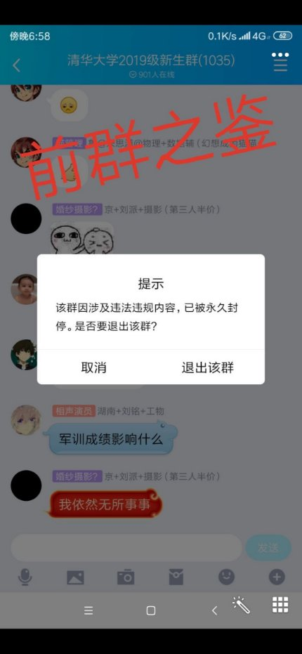

**清华三字班梗字典**

欢迎来到清华大学2023级新生群！本字典可用作水群/与清华同学交流时的日常用语参考。若发现内容有事实性错误，可以联系该文档在清华大学2023级新生群中的发布者。

**名词篇**

n  PKU/P大/我北/我校：指北京大学 Peking University（#9b0000）

n  THU/T大/你清/你校：指清华大学 Tsinghua University（#743481）

n 华大/华清大学：通常用于饱含恶意地影射华大学。

n  隔壁：常用以指某距离世界一流大学最近的北京大学

n  精北：即比起清华人，在精神上更像是大人，崇尚北京大学“思想自由，兼容并包”的风气。可称QQ群T一景。（反义词：精清/精华

n  awsl：“啊我死了/阿伟死了”，指看到了可爱的事物的感慨。

n  **ddl**: 即deadline，一般指作业截止日期，有时也泛指某个事情到期时间或某项任务。例句“我有两个ddl搞不完了”。

n  xm: 即羡慕

n   女装：字面意思，大家欢迎的一种活动

n  鸽：放鸽子的别称，指与别人定好后不@赴约，也指不参加某些活动。“咕/咕咕咕”与之同义。

n  极其先进的信息化系统：选课系统验证码区分大小写。但是每当选课的时候总会离奇掉线

n  特奖：清华大学特等奖学金，名额极少。

因近两年有某著名丑闻，有时也含讽刺意味（丑闻目前只出现在候选阶段，目前还没有选上以后爆出丑闻的）

n   基于TCP的网络优化器：翻Q工具的美称，与某特奖候选人有关

n   捐楼: 校内有许多知名人士捐赠的大楼，群里说某人捐楼一般用于吹捧(或捧杀)

n  闭社/毕设：你清近来新出现的封闭式校园社交平台（链接：<https://thu.closed.social>），凭清华邮箱注册/登录，欢迎使用。（更常用树洞4

n  树洞：一个校内论坛，上面会有各种各样的猎奇感情故事和校园传说。~~网址为thuhole.com，需要邮箱注册~~**（thuhole.com已于2021年关停。R.I.P)(新树洞https://new-t.github.io/需要魔法**（注：这是一个完全匿名平台，接受能力差者谨慎访问)

n  1911星球：另一个校内**官方**论坛，planet.tsinghua.edu.cn，需要清华电子身份认证

n  炼丹：通常指深度学习的模型训练过程（且常含有调侃意义/贬义），因需要精挑细选超参数（hyperparameters）且含有玄学色彩，和炼丹的过程很像而得名。

n  CS：指计算机科学，可作为计算机系代称（但b是更常称为贵系）。

**地名**

n   清芬三：清芬园三层，指教师2食堂，是唯一不可以刷学生卡的食堂。

n  华大学：源于之前清华大学东门外“清华大学”石雕被撞，仅存“华大学”三字和“厚德载物自强”校训，所以一天吞吞吐吐也一样“华大”/“华大学”就：是“清华大学”的简称。

n  X字班：从古至今的清华人沟通的校内黑话。入学年份的最后一位记为X，则称生为X字班同学。如各位是三字班，而我们这些即将大二的狗是二字班。可在“校友”见面时，用于简单识别是不是清华学生（诈骗还是很多的 做好防范）

n  GPA：绩点（grade point average），类似于高中的成绩，最高4.0，具体计算方式见群文件新生手册

n   jysks/精英商科生：指经济、融、管理、会计等专业的学生，多用于褒义，表达工科生和理科生们对商科生人文素养高、擅长言辞、自信阳光、擅长规划个人前途、注重个人形象、人际关系丰富等特质的钦佩与羡慕

n  npy：男/女朋友numpy，多用以指（下略）。（著名句式：现在的人其实比起npy，更想要py）

n  ssfd：瑟瑟发抖

n  tkpl：“太可怕了”的缩写，同时也有“退课跑路”之意

n  tqlwsl：太强了我死了/天气冷我睡了

n   tyt：停一停，是某些水群大佬在插不上嘴时常见的表达方式

n   现充/人赢/线虫/🐛：有npy的人

n   池面：长的帅的男人，比如海跃、海刚，源自日语“帅哥”的读音

n   手癌：指打字出现错别字的情形，修正时可用“\*+修正后的字段”。手癌写诗是好文明（确信）。也简称“癌”

n   表示理解：工字厅用语。当学校面对学生的合理诉求却不想解决的时候会使用这句话安抚学生情绪。

n  卖弱：假装自己什么都不会、装颓废或者假装自己没考好的行为，是大佬们的常见戏码。

n  膜：膜拜的简称，指对长者表示敬意，或者对群内大佬表示仰慕。

n  大作业：顾名思义，是一种常见而可怕的东西。一门课程可能会同时布置小作业、大作业，大作业综合性强，要求较高，时常令人害怕

n  乌鸦：你清特产，晚上很吵，见到快跑，会投弹攻击（指鸟粪）。

n  土豆：极其先进的信息化系统所使用的服务器。

n  你清BBS：指知乎。由于很多事情同学们会放在知乎上从容讨论，故称。

n  煮屎：指生命科学实验。源自于某关于斗破苍穹的知乎回答“如果我们这都算炼丹的话，那生命科学他们在干什么？煮屎吗？”

n  次世代/某社/你社：指清华大学十佳社团次世代动漫社，加入就有“走错大学第一步”的好处（入社需要交爱（指25）/退社交450（不是））

n  幻协/某协/你协：指清华大学学生科幻协会，来加（会费十块钱自备x（当然现在应该没有会费了

n  二十一世纪的学科：指生命科学，来源于农大前任校长陈章良，因被清华大学前副校长施一公老师引用广为人知。

n  贵系/柜系/跪系/gay系：计算机系

n   茶园/叉院/IIIS：交叉信息研究院（姚班，期QI班，智班）

n   雷系：自动化系，得名于2020年大一C++大作业“雷课堂”

n   无系：指电子系，得名于前身的无线电系。（又名脸系，得名于这个暑假小学期大作业需要机器识别人脸性别）

n    🐛系：指电机系，得名于电机系中线虫较多。

n   IE：指工业工程，可作为工业工程系代称，也作工工。

n  EE：指电子工程，可作为电子系代称。

n  ME：指机械工程，除了工物男女比最高的院系（注：现男女比前三高的院系按顺序分别为“真茶贵”，即求真、茶园、贵系）。

` `使用时可参考清华大学校园地图：[链接](https://www.tsinghua.edu.cn/__local/2/D5/FC/77378550B8304647E7C6796C9D3_AB9BDD96_2E2D31.jpg)

xx园：校内食堂多以某某园命名，如紫荆园，清芬园，玉树园等等。所以这一格式有时也用于指食堂 

n   有时也以紫荆，清芬等简称（紫荆园在重新开张后有别名“蛇园”）

n 紫操：即紫荆操场，因学生宿舍紫荆公寓得名 

n  类似词有东操，西操，北操等

tips：北操足球场请从其东南角处的入口进入

l  螺母楼：即罗姆楼，电子系系馆，两大特点，一个是高，一个是通宵开放（但有概率在1~2点驱赶非电子系同学）

l  工字厅：校长办公室所在地，水木清华背后，常用来代指学校管理人员。

l   新清：新清华学堂，一般用于大型活动与演出，也有电影可以买票（看电影要在大礼堂）

l   x教：第几教室楼的简称，如四教，六教

**Tips**：可以根据教室的编号识别在哪栋教学楼，三位数中101~310属于一教，401~404属于二教；四位数中第一个数字为1~3为三教，分别对应三教一段到三段，第二个数字是楼层（例如2301代表三教二段三楼第一个教室）；开头为4为四教，5为五教，第二位数字也是楼层；五位数中第一位数字是6代表六教，第二位为A/B/C代表六教的某个区，第三位为楼层。

l  C 楼，学生服务中心，因楼像C得名。C楼也有教室，教室号以C开头，后接三位数，第一位为楼层

l   W 楼，紫荆公寓北侧的一排宿舍楼，因楼像 W 得名

l   主楼: 最主要的楼，在学校中轴线上(x)，楼前有广场。（也是某些没有系馆的院系的驻地）

n  一般指公开场合，比如上主楼天台

l   学堂路/新民路：校园内两条主要的南北向道路。

l   李兆基：李兆基科技大楼，规模庞大，以容易迷路闻名

l   东主楼：中央主楼东侧的楼。计算机系和软院系馆

l   东机房：入口位于中央主楼后侧。

l  西主楼：中央主楼西侧的楼。（欢迎来到电机系）

l   x图: 指几个独立的学科图书馆

l   x馆：指清华图书馆各部分

n   北馆/李文正馆：图书馆三期工程，最新的一部分

n   西馆/逸夫馆：图书馆二期工程，主要为科技图书，和北馆连在一起

n   老馆：指图书馆老楼，充满年代感的地方（在图书馆中关门最/\*大学\*/晚，但是插座稀少）（暂时关闭）

n   文图/文科馆：凯风人文社科图书馆，交通便利，环境舒适，是自习(x)的好去处。座位需要选座机，常爆满。

n   法图：法律图书馆，通常指新盖好的廖凯原楼（区分于旧的法图即明理楼）

n   建筑图书馆，经管图书馆，美术图书馆等没有独立的建筑，一般也没有建图经图之类的说法，通常直接以建馆/五金/美院代称

l   艺博：艺术博物馆

l   技科楼：东南门附近的材料学院的大楼，常用教室3216/3311/3417要绕行

l   蒙楼：蒙民伟先生捐赠的几个楼，一般都简称蒙楼，需要根据语境判断指的是哪一个

n   新清华学堂附近的蒙民伟音乐厅

n   蒙民伟楼，艺教中心，在西操旁边

n   蒙民伟科技楼，分南楼北楼， 实验室大楼，位于校园东部

l   清青：一般指清青快餐，又称QQ快餐，开放时间长，适合错过饭点的人

l   邺架轩：北馆地下的一个书店，24h开放自习，提及邺架轩一般就睡不了觉了

l   紫咖：紫荆书咖的简称，位于万人地下，也是一个适合通宵自习的书店

l   猫超：天猫超市的简称，一般指C楼地下的店，因为过去只是C楼超市也被叫做C超。

l    紫四：可以代指很好吃的一层食堂，也可以代指一栋寝室楼（其余同理）（可以使用蛇四区分）

l   MSB：Medicine Science Building，医学科学楼

l   综体：综合体育馆，位于东操南侧。

l   南区：指清华除留学生外最好的本科生活区。入住的本科生有经管男生、生科男生、工工九字班及以上男生、物理男生、没被赶走的新雅男女生，部分强基书院学生等。宿舍楼内楼边有健身房，打印店，水果店，理发店，超市，七港九奶茶店，数码3C店，洗衣店等。

l   旧馆：地图上的生物学馆，生物旧馆。

l   新馆：地图上的伟伦馆，生物新馆。

l   天文台/气象台：位于理科楼南侧，会不时开放。

l   建馆报告厅：建馆东北侧的报告厅，适用范围不限于建筑学院，常用作大活动的报告厅或考试教室。

l  自助放气桩：指自助修车桩，

为了体现清华世界一流先进性而在学校内散布的设施。顾名思义，其充气装置只能用来给车轮胎放气。()

## 杂

军训成绩影响什么 我依然无所事事（前群之鉴）（经典再现）

（纯享版）

中式小吃 Chinese snake（紫荆园重新装修后开业当天，中式小吃档口英文配字为Chinese snake而非Chinese snack，也导致紫荆园食堂有别名“蛇园”）（一般“紫一”“紫二”指紫荆公寓一号楼，二号楼。可以用“蛇一”“蛇二”指紫荆园食堂一楼，二楼。蛇二的方便面加辣条炒饭非常好吃，希望大家都去尝一尝。）

n  11g：施一公，指清华前副校长，生命学院前院长，西湖大学校长，中国科学2院院士，著名结构生物学家。

n  1975级化工系校友：中共中央总书记、国家主席、中央军委主席习近平同志。

